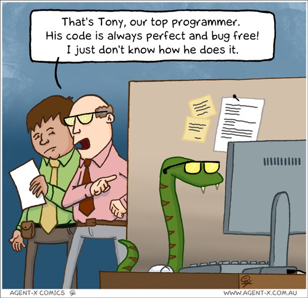

# Python

## Курсы

[Программирование на Python](https://stepic.org/course/Программирование-на-Python-67) — [Bioinformatics Institute](https://stepic.org/users/651763/teach) / [Stepik](https://stepik.org/)  
[Google's Python Class](https://developers.google.com/edu/python/) — Google  
[Python: основы и применение](https://stepic.org/course/Python-основы-и-применение-512) — [Bioinformatics Institute](https://stepic.org/users/651763/teach) / [Stepik](https://stepik.org/)  
[Introduction to Computer Science and Programming Using Python](https://www.edx.org/course/introduction-computer-science-mitx-6-00-1x) — MITx / [edX](https://www.edx.org/)  

## Порталы

[Real Python](https://realpython.com/) — Python Programming by Example  
[Full Stack Python](https://www.fullstackpython.com/) — Python for Web Deployment  
[CheckiO](https://checkio.org) — портал с множеством задач на Python и JavaScript. Интерфейс офрмлен в игровом стиле, задачи разбиты на блоки от простых до самых сложных. Есть поддержка русского языка, а также по каждой задаче даётся пояснение её применения на реальных проектах.  
[HackerRank](https://www.hackerrank.com) — портал с множеством задач и интерактивных обучающих материалов по Python и по другим языкам программирования. Также есть обучающие материалы по теории Computer Sciense.  

## Задачи

[CodingBat](http://codingbat.com/python) — набор задач от [Ника Парланте](http://cs.stanford.edu/people/nick/), лектора на курсе [Google's Python Class](https://developers.google.com/edu/python/) и преподавателя Computer Science в Стэнфорде.  
[Адаптивный тренажер Python (Stepik)](https://stepik.org/course/431) — набор задач на языке Python. Сложность задач варьируется от начальной до высокой. Курс можно пройти в специальном адаптивном режиме.  
[Adaptive Python (Stepik)](https://stepik.org/course/568/) — адаптивные задачи от JetBrains. Сложность варьируется в зависимости от вашего уровня.  
[Python Challenges](http://www.pythonchallenge.com) — задачи, постепенно возрастающие по сложности.

## Ссылки

[Типичный программист (Материалы для изучения Python)](http://tproger.ru/digest/python-materials/)
